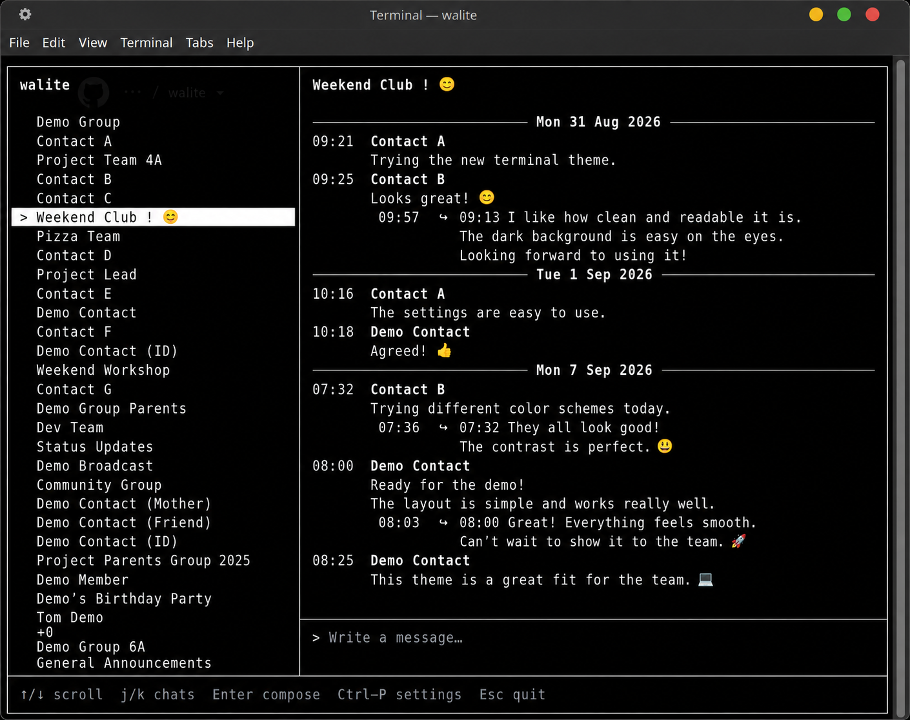
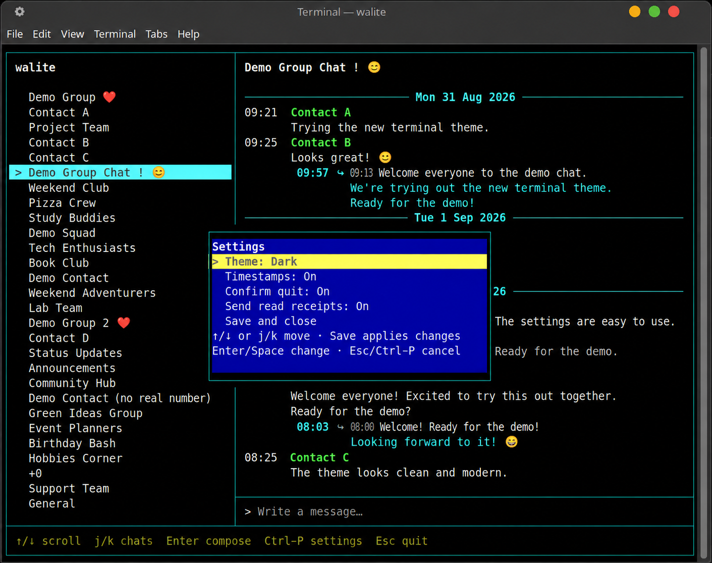
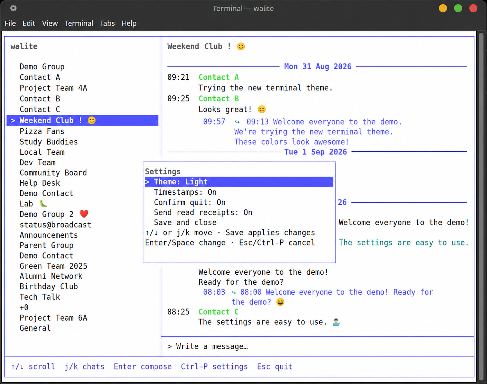
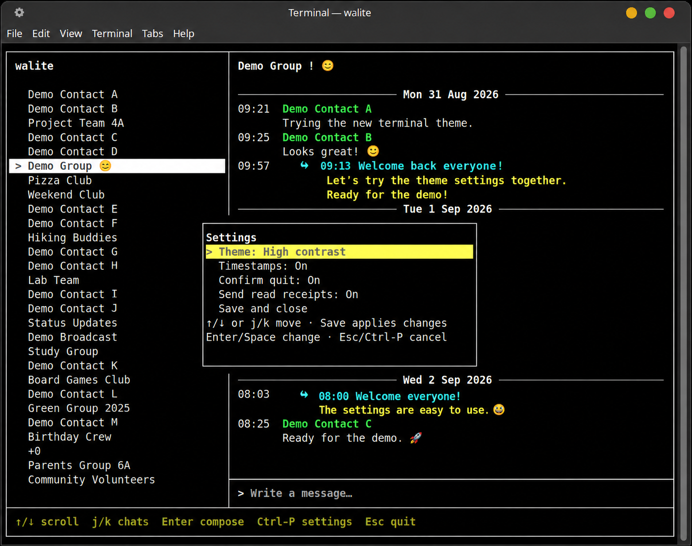

# walite

walite is a lightweight, keyboard-driven WhatsApp client for the terminal. Written in Go, it connects as a linked device through [whatsmeow](https://github.com/tulir/whatsmeow) and uses a bounded SQLite cache for fast startup and predictable resource use.

The project was developed and tested on an old Core 2 Duo MacBook Pro running Linux, but it is designed as a general terminal-native client rather than for one machine. walite is unofficial and is not affiliated with WhatsApp or Meta.

## Why walite?

walite began as an experiment to make WhatsApp usable on an older Linux laptop without keeping a heavyweight browser client open. Its priorities are keyboard-first interaction, fast cached startup, bounded queues and working sets, modest resource use, and a workflow that feels at home in a terminal.

## Screenshots

Four themes, with settings available through `Ctrl-P`.

| Terminal (default) | Dark |
| --- | --- |
| [](docs/screenshots/walite-terminal.png) | [](docs/screenshots/walite-dark.png) |
| **Light** | **High contrast** |
| [](docs/screenshots/walite-light.png) | [](docs/screenshots/walite-high-contrast.png) |

These screenshots were AI-edited for privacy using demo names and messages. Text rendering and spacing may differ from the application.

## Features

- Linked-device QR pairing and persistent reconnects
- A one-time dedicated pairing window on the validated Linux/XFCE setup
- Broad HistorySync conversation bootstrap
- Persistent pure-Go SQLite cache with no CGO requirement
- Up to 10,000 lightweight chat summaries and bounded recent message history
- Cached startup without waiting for a complete HistorySync
- Explicit bounded older-history paging
- Incoming and outgoing text messages
- Image, video, document, audio, and sticker messages shown as lightweight placeholders
- Explicit media download/save, plus inline image/GIF and WebP sticker preview through optional `ueberzugpp` X11 overlays
- One-to-one text replies—including replies to media placeholders—and incoming quote rendering
- Contact, group, and group-participant names when authoritative local metadata is available
- Readable phone-number fallbacks plus PN/LID identity handling and deduplication
- Directional incoming/outgoing layout and date separators
- Persistent local unread state and WhatsApp read receipts on explicit chat selection, reply, or compose/send interaction
- Unicode-safe composition and rendering
- Emoji picker with persistent recent emoji
- Functional `Ctrl-P` settings with four themes: Terminal, Dark, Light, and High contrast
- Toggles for timestamps, quit confirmation, and read receipts

## Installation and build

Building walite requires Go 1.26.0 or newer. MX Linux with XFCE/X11 on linux/amd64 is the currently validated runtime environment.

```sh
git clone https://github.com/antoinebaudrimont-beep/walite.git
cd walite
go build ./cmd/walite
./walite
```

You can also run it directly from the source tree:

```sh
go run ./cmd/walite
```

## First pairing

On first launch, walite links to WhatsApp using a QR code. On the current Linux/XFCE implementation, it opens a temporary `xfce4-terminal` window sized to render the QR code without distortion. On your phone, open **WhatsApp → Linked devices → Link a device**, then scan the code.

The pairing window closes after a successful link. Later launches reuse the persisted session and reconnect without another QR code. If the helper cannot be launched, walite prints a manual `walite --pair` fallback command.

## Usage

### Chat navigation

| Key | Action |
| --- | --- |
| `j` / `k` | Select the next / previous chat |
| `↑` / `↓` | Scroll message history |
| `PageUp` / `PageDown` or `Ctrl-U` / `Ctrl-D` | Scroll history by a page |
| `Home` / `End` | Jump to the oldest / newest loaded message |
| `O` | Load one bounded page before the oldest loaded message |
| `Enter` | Start composing |
| `Ctrl-R` | Select a message to reply to |
| `P` | Preview the newest visible supported media placeholder |
| `S` | Save the newest visible media item to `~/Downloads/walite` |
| `Ctrl-P` | Open settings |
| `Esc` | Quit, or ask for confirmation when enabled |
| `Ctrl-C` | Quit immediately |

### Composing and popups

| Key | Action |
| --- | --- |
| `Enter` | Send the draft |
| `←` / `→`, `Backspace`, `Delete` | Edit the draft |
| `↑` / `↓`, `PageUp` / `PageDown`, `End` | Browse history without losing the draft |
| `Ctrl-R` | Choose a reply target |
| `Ctrl-E` | Open or close the emoji picker |
| `Ctrl-P` | Open settings |
| `Esc` | Cancel the current mode or close a popup |

In reply selection, use `↑`/`↓` or `j`/`k`, then `Enter` to confirm. In the emoji picker, use the arrow keys or `h`/`j`/`k`/`l`; `Tab` and `Shift-Tab` switch categories, and `Enter` inserts the selected emoji.

Media is never downloaded in the background. Scroll until the intended media placeholder is the newest visible media row, or focus it with `Ctrl-R` and the arrow keys, then press `P` to preview or `S` to save. Images, ordinary GIFs, and WebP stickers use an inline `ueberzugpp` X11 overlay; video (including WhatsApp GifPlayback MP4) and audio open in `mpv`; PDF documents open in `zathura`. Other document types remain save-only. Video/GifPlayback previews loop continuously; audio plays once. Inline overlays close with `P`, `Esc`, navigation, resize, or application shutdown. External viewers survive navigation; `Esc` in walite closes the active viewer without quitting walite. Once it closes, `P` can reopen the same media and `Esc` resumes its normal behavior. One external viewer is allowed at a time and is also closed on application shutdown. All viewers are optional, and a missing backend is reported without blocking the TUI.

## Settings

Press `Ctrl-P` to configure:

- **Theme:** Terminal, Dark, Light, or High contrast
- **Timestamps:** show or hide message times
- **Confirm quit:** require confirmation when quitting with `Esc`
- **Send read receipts:** enable or suppress new remote read receipts

Use `↑`/`↓` or `j`/`k` to move between settings. `Enter` or `Space` changes the selected value. Choose **Save and close** to persist and apply the changes; `Esc` or `Ctrl-P` closes the panel and discards unsaved edits.

Settings are stored in `$XDG_CONFIG_HOME/walite/config.json`—normally `~/.config/walite/config.json`. Timestamps and read receipts default to On; quit confirmation defaults to Off. Disabling read receipts does not stop walite from clearing its own local unread badge when you explicitly select, reply in, or compose/send in a chat.

## Chat history and cache

HistorySync seeds a broad conversation list during initial setup. Chat summaries and bounded message pages are stored in SQLite, allowing later launches to display cached conversations immediately.

The cache keeps at most 10,000 chat summaries. Background chats retain at most 32 in-memory messages; only the selected chat expands to a fixed 256-message browsing buffer, so the summary list never becomes a 10,000 × 256 allocation. At the oldest loaded boundary, press `O` to prepend one page of up to 50 older messages without discarding the recent conversation. The request is explicit and never chains automatically; imported messages are deduplicated and remain in SQLite across restarts. When the selected buffer reaches 256, new committed messages evict the oldest retained rows, while loading still-older rows never evicts newer context. Explicitly downloaded decrypted media uses a separate private cache under `$XDG_CACHE_HOME/walite/media` (normally `~/.cache/walite/media`), bounded to 256 files and 256 MiB. Durable saves under `~/Downloads/walite` are never evicted with that cache.

## Performance

These development measurements were recorded on an Intel Core 2 Duo T9900 MacBook Pro running Linux/amd64. They are target-machine observations, not universal benchmarks.

| Operation | Time |
| --- | ---: |
| List 1,000 cached chats | 11.20 ms |
| List 10,000 cached chats | 118.59 ms |
| Load the newest 50-message page | 0.761 ms |
| Build and draw the first frame from 10,000 cached summaries | 14.94 ms |

Bounded chat/message working sets, fixed-capacity asynchronous workers and queues, and SQLite-backed persistence keep resource use predictable.

## Architecture

```text
terminal UI
    ↓
service/core
    ├── SQLite cache
    └── WhatsApp adapter (whatsmeow)
```

The UI and service use transport-neutral application data. WhatsApp-specific types stay inside the adapter, and bounded workers keep network and storage operations out of the terminal event loop.

## Current limitations

- Preview backends are optional: image/GIF and WebP sticker overlays require Linux/X11 and `ueberzugpp`, video/audio require `mpv`, and PDF documents require `zathura`. Other document formats remain save-only.
- Expired WhatsApp media references are reported as unavailable; media-retry refresh is not implemented yet.
- Reactions, typing indicators, and presence are not implemented.
- Quoted-reply sending is supported for one-to-one chats, not groups.
- Status and broadcast handling remains limited.
- Some identities remain opaque when WhatsApp provides no usable authoritative local metadata.
- Linux/amd64 is the validated platform.
- Automatic pairing-window launch is currently specific to XFCE and `xfce4-terminal`.
- macOS is not yet officially supported.

## Roadmap

### v0.3.0

- Image/GIF and sticker download, save, and inline preview through `ueberzugpp` (v0.3B1)
- Video/audio preview through `mpv` and PDF preview through `zathura` (v0.3B2)
- Text replies to media messages using bounded placeholder metadata
- On-demand older-history paging with a 256-message selected-chat working set (v0.3C)
- Read receipts for explicit interaction with an already-selected unread chat

Planned image flow:

```text
image message
  → visible media placeholder in walite
  → user requests preview
  → walite downloads and decrypts the image
  → bounded private cache
  → inline ueberzugpp X11 overlay opens
```

### v0.4

- Reactions
- Improved group behavior
- Better status and broadcast handling
- Additional media and document support

### v0.5

- macOS portability
- Linux and macOS release binaries
- Packaging and installation improvements

### v1.0

- Stable, documented release
- Dependable core messaging and cache behavior
- Easy installation
- Clearly defined supported and unsupported features

No release dates are promised.

## Development

The SQLite backend is pure Go and does not require CGO. The main validation commands are:

```sh
go vet ./...
go test ./...
go test -race ./...
git diff --check
```

## Disclaimer

walite is an unofficial project and is not affiliated with, endorsed by, or sponsored by WhatsApp or Meta. It uses the independent [whatsmeow](https://github.com/tulir/whatsmeow) library to connect to WhatsApp.
